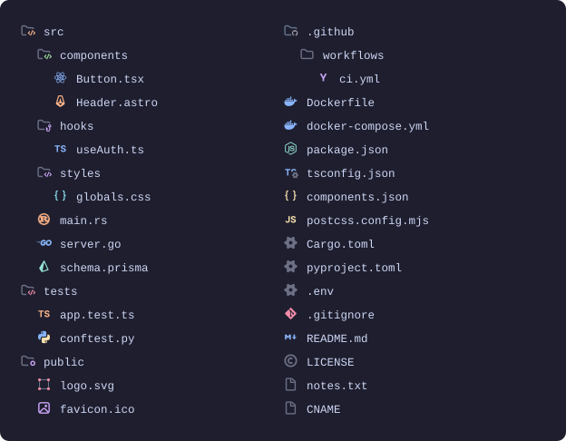
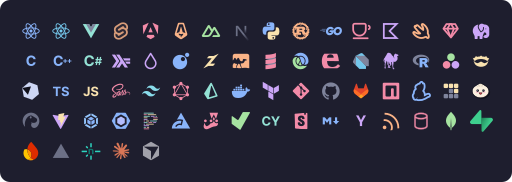

# Catppuccin Noctis Icons for Zed

The [Symbols](https://github.com/joangarciaa-dev/zed-symbols) file icon pack,
recolored to [Catppuccin Mocha](https://github.com/catppuccin/catppuccin) using
colors taken from the VS Code
[Catppuccin Noctis Icons](https://github.com/alexdauenhauer/catppuccin-noctis-icons)
theme.

<p align="center">
  
</p>

<p align="center">
  
</p>

Both images are composited from the shipped icons, with every filename resolved
through the theme's own association table — so they show exactly what Zed
renders, and cannot drift from the pack. Regenerate with
`python3 build/preview.py`.

Both packs derive from the same base artwork, so this keeps Symbols' much larger
association table and moves only the palette across:

|               | this theme | VS Code Noctis |
| ------------- | ---------: | -------------: |
| icon files    |        355 |            246 |
| file suffixes |        571 |            348 |
| file stems    |       1564 |            587 |
| named folders |        601 |             80 |

## Install

**Durable route — survives Zed updates.** Run `zed: install dev extension` from
the command palette and pick this folder, then set:

```json
"icon_theme": "Catppuccin Noctis Icons"
```

Dev extensions are never auto-updated, so nothing can overwrite this. Keep the
folder where it is — Zed points at this path.

**Quick route — no install step.** `./install.sh` patches Zed's installed
Symbols pack in place. Works immediately with
`"icon_theme": "Symbols Icon Theme"`, but Zed's updater will wipe it whenever
upstream Symbols ships a new version. Re-run `./install.sh` to put it back.
`./install.sh --restore` returns Symbols to stock.

## How the colors were derived

152 icons are byte-identical between Symbols and Noctis once colors are
stripped, which yields an exact Tailwind → Mocha mapping by diffing them. That
map drives 986 color swaps across the pack.

Colors that never appear in a shared icon can't be looked up. Rather than guess,
**55 icons keep their original Symbols palette** — nearly all are brand logos,
where a guessed recolor destroys the brand scheme for no fidelity gain. The
`black` and `white` keywords are still converted even there, since pure black is
invisible against Zed's `#1E1E2E` file tree and carries no brand meaning.

Eight icons are adopted from Noctis wholesale, artwork included: `python`,
`visual-studio`, `crystal`, `svelte`, `svelte-ts`, `gleam`, `bun`, `vite`.

## Deliberate differences from Noctis

- Noctis maps `black` to `#11111B`, which is _darker than the file tree it sits
  on_ — `csv` and `jenkins` are close to invisible there. Here they lift to
  `#7F849C`.
- `.tsbuildinfo`, `.jsonc` and `.json5` are unmapped in both upstream packs and
  fall through to Zed's default icon. Here they use the JSON braces.
- `ts-types` (`.d.ts`, `.d.cts`, `.d.mts`) is recolored blue to match the
  TypeScript icon instead of standing alone in green.
- Associations changed to match Noctis: `.css` → sky brackets, `.txt` →
  document, `components.json` → JSON braces, `postcss.config.mjs` → JS, and all
  128 `docker-compose.*` variants → the blue docker icon.

Icon geometry is otherwise left exactly as upstream draws it.

## Upstream bugs fixed

Symbols ships 21 associations pointing at icons its own theme JSON never
declares, so those files silently fall back to Zed's built-in glyph:

- **`git` was never declared**, despite `git.svg` shipping in the pack. That
  broke all 20 git-file associations — `.gitignore`, `.gitattributes`,
  `.gitconfig`, `.gitkeep`, `.gitmodules` and their uppercase variants.
- **`.less` pointed at a `less` icon** that exists in no pack. Retargeted to the
  same glyph as `.css`.
- **`Dockerfile`** — the canonical capitalisation — had no rule at all; upstream
  only covers `dockerfile` and `DOCKERFILE`. Added, along with `Containerfile`.

Dangling associations: 21 → 0.

Zed also matches suffixes case-sensitively and offers no way to set a fallback
icon, so unmapped extensions are filled in explicitly — see `SUFFIX_FALLBACKS`.

## Rebuilding

```bash
python3 build/build_extension.py
```

`build/upstream/` vendors pristine copies of both source packs, so the build
needs no network, no Zed install and no VS Code extension present. Every
customisation lives in `build/palette.py` as a named constant — `ADOPT_NOCTIS`,
`BRAND_KEEP`, `SUFFIX_OVERRIDES`, `STEM_OVERRIDES`, `ICON_RECOLOR`,
`SHAPE_TWEAKS`. Edit there and rebuild; `icons/` is generated output.

`python3 build/compare.py` diffs the result against Noctis and reports what
diverges.

## Licence

Symbols is MIT (Joan Garcia). The Catppuccin palette is MIT (Catppuccin org).
This retint is MIT.
